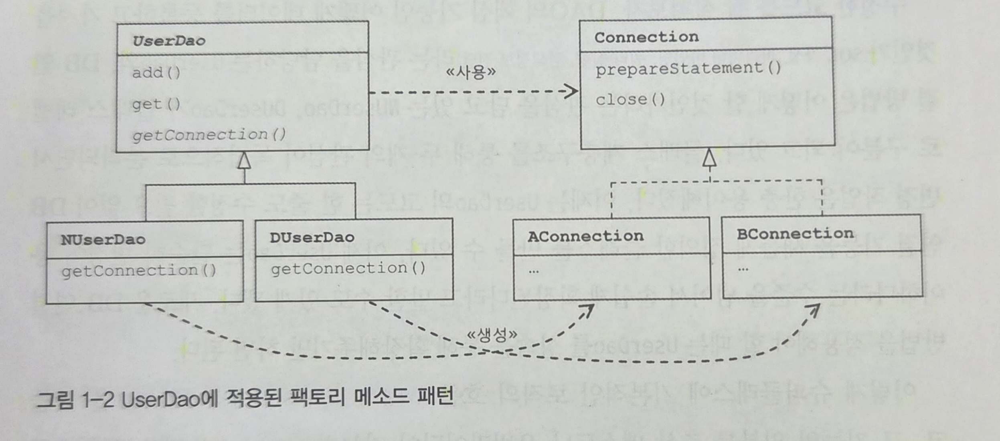

## 주요 내용 정리

___

### ✅ 개발자가 객체를 설계할 때 가장 염두에 둬야 하는 사항은 바로 미래의 변화를 어떻게 대비할 것인가이다.

### ✅ 좋은 개발자는 최소한의, 확신을 가진 작업만으로도 기능을 수정해낸 개발자다.

### ✅ "분리"와 "확장"을 고려한 설계가 필요한 이유다.

### ✅ 이 챕터에서 메소드 추출을 통한 분리를 먼저 살펴보고, 상황을 상정하여 상속을 통한 확장까지 살펴볼 수 있다.

## 참고 파일

___
[난감 DAO](../../../src/main/java/Chapter_01/DAO/UserDao.java)

[DB연결 관심 분리(메소드추출) DAO](../../../src/main/java/Chapter_01/DAO/UserDao2.java)

[상속을 통한 확장 DAO](../../../src/main/java/Chapter_01/DAO/UserDao3.java)

[상속을 통한 확장 구현체 DAO](../../../src/main/java/Chapter_01/DAO/NUserDao3.java)

